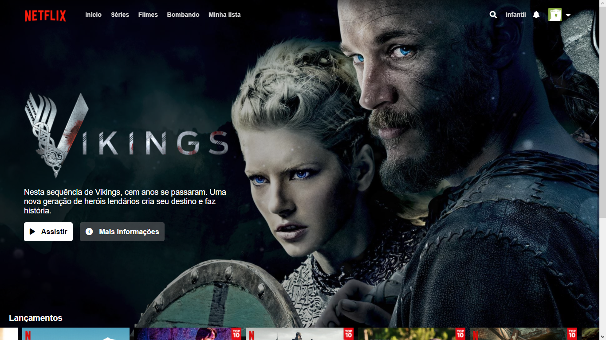

# Netflix Clone

## Sobre o projeto:

Projeto desenvolvido com base no bootcamp da Inter Frontend Developer, ministrado através da plataforma da DIO.

O objetivo deste projeto foi desenvolver minhas habilidades ao tentar criar um clone do site da Netflix. Inicialmente o projeto visa criar apenas a parte visual do site e futuramente o projeto poderá ser retomado para aplicação de novas páginas e tecnologias para interação com o usuário. Busquei também atualizar o layout do site para que ficasse o mais parecido possível com o site da Netflix atualmente.

## Layout do projeto:

## Tecnologias utilizadas

* HTML5
* CSS3
* JavaScript

## Autor

*Rebeca Bertolini Spósito*

Linkedin:
<https://www.linkedin.com/in/rebeca-bertolini-spósito-544048200/>

E-mail:
<rebeca.bertolinii@gmail.com>